# TerraForge

**A native node-based 3D terrain and environment studio.**
Geekatplay Studio.

TerraForge builds photoreal landscapes from a node graph: procedural and
simulated terrain, layered PBR materials, volumetric sky, water, and offline
path-traced rendering — all in a single native C++ application with a
real-time OpenGL viewport.

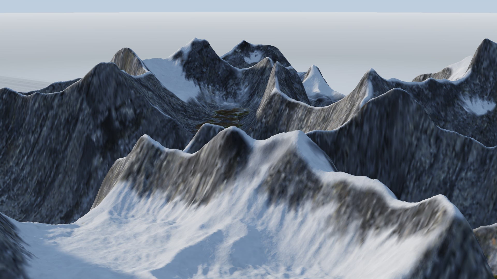

*Five nodes made this. Ridged noise, pipe-model water erosion, then one
ErosionLayers node that hands back where the rock, scree, soil, grass and snow
belong — each one a photoscanned surface, placed by the erosion rather than by
hand. Rendered in the viewport, in real time.*

## Gallery

Every image on this page comes out of the application's own viewport, from a
node graph, with no compositing and no touch-ups.

| | |
|:--:|:--:|
| 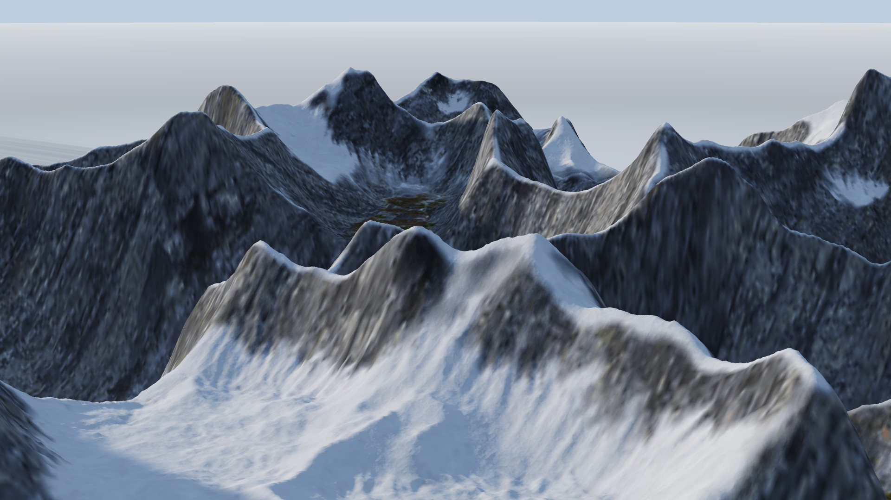 **Alpine** — granite, scree and snow above the treeline | 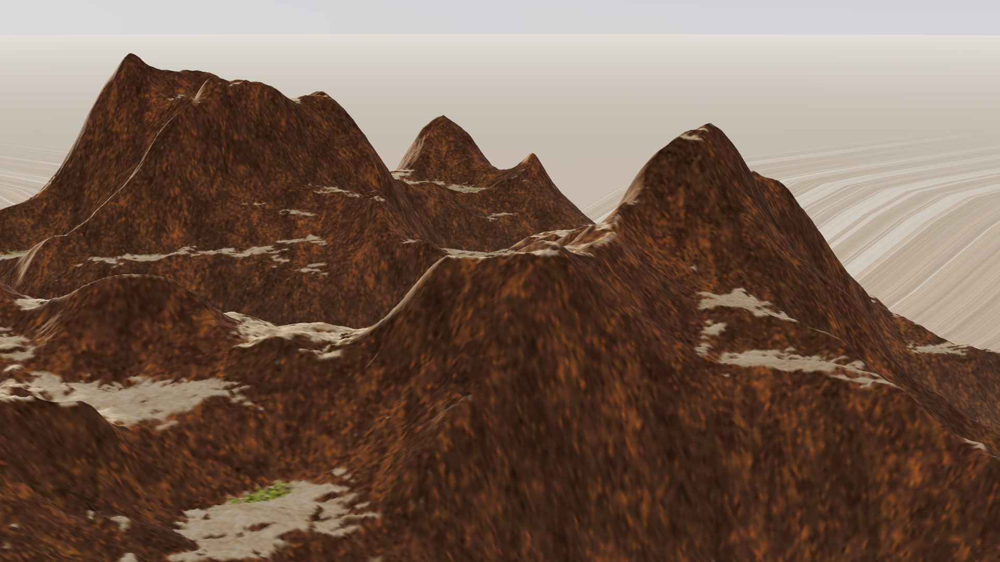 **Red mesa** — sandstone under a low afternoon sun |
| 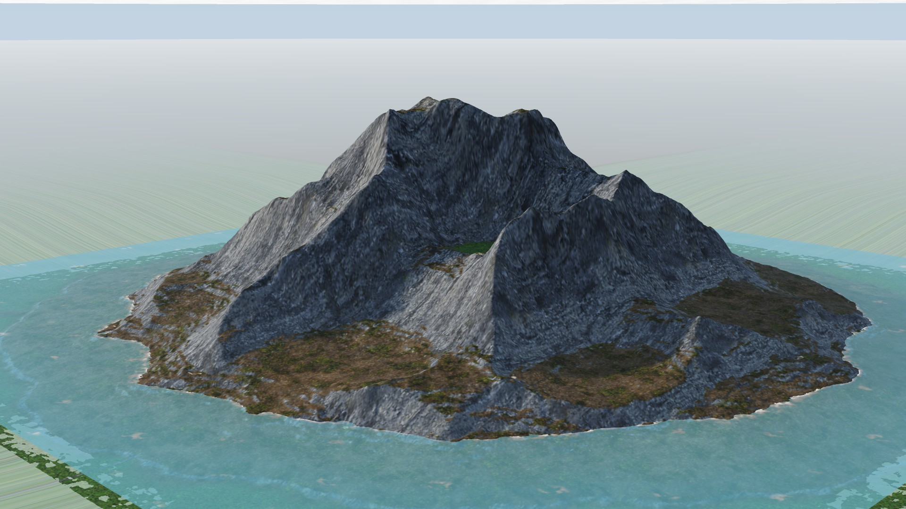 **Island** — shoreline foam, shallow water, grass on the lee slopes | 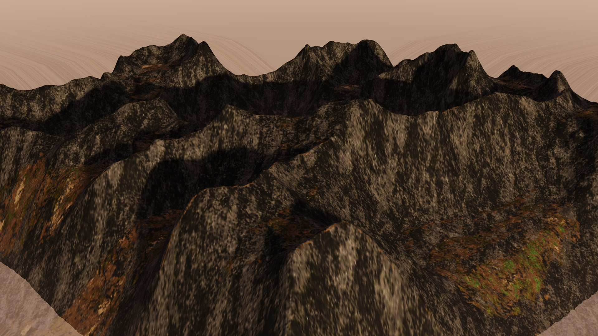 **Volcanic** — dark basalt and a caldera at dusk |
| 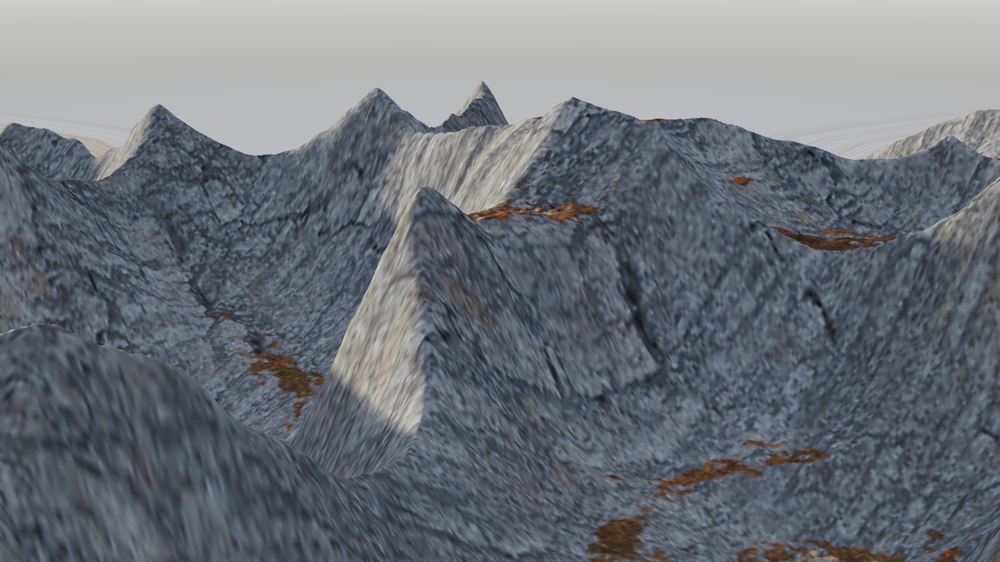 **Limestone ridge** — pale rock cut by drainage | 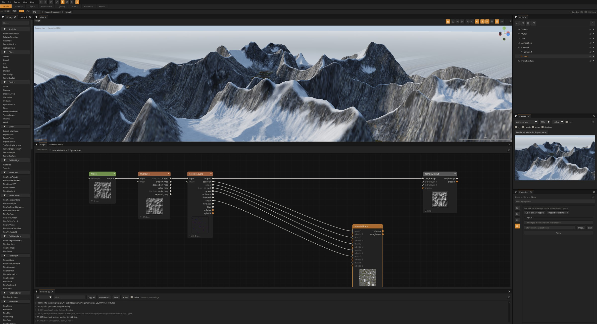 **The studio** — the graph that made the view above it |

The five landscapes differ only in their noise, their materials and their
light. The erosion chain underneath is the same one every time, and every
picture is reproducible: start the app and run

```
python scripts/make_gallery.py
```

which builds each scene through the same action inbox the assistant and the
MCP tools use, then photographs it.

---

**[terraforge.art](https://geekatplaystudio.github.io/TerraForge.art/)** — the
gallery and the studio, in pictures.
**[Install guide](docs/INSTALL.md)** — Windows, macOS and Linux, from a
one-click installer to building it yourself.
**[Node reference](docs/NODES.md)** — every node, port and parameter,
generated from the registry itself.
**[Developer guide](docs/DEVELOPER_GUIDE.md)** — goals, roadmap, architecture
and how we work, for anyone who wants to join.
**[Layered materials](docs/MATERIAL_LAYERS.md)** — how a material stacks,
what decides where each layer shows, and what was taken from Vue.
**[Community posts](docs/COMMUNITY_POSTS.md)** — the project in three lengths.

## Who is building it

TerraForge is written by **Vladimir Chopine**, co-founder of
[Geekatplay Studio](https://www.geekatplay.com) — co-author of the official
Vue guide, *Vue 7: From the Ground Up* (Focal Press), and *3D Art Essentials*
(Focal Press), and the author of more than 3,000 tutorial episodes and
workshops on landscape and environment work in Vue, Terragen, World Machine
and the pipelines around them, over 35 years in film, VFX and design. This is
the landscape workflow he has taught for twenty years, built as the tool he
wanted his students to have.

## Screenshots

| | |
| :--- | :--- |
|  *Terrain: noise into water erosion into layered erosion, each node carrying its own preview and its own timing.* | 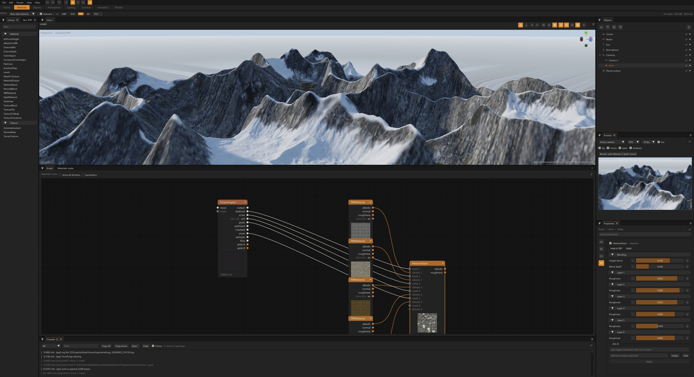 *Materials: five photoscanned surfaces, each masked by what the erosion decided, blended height-aware.* |
| 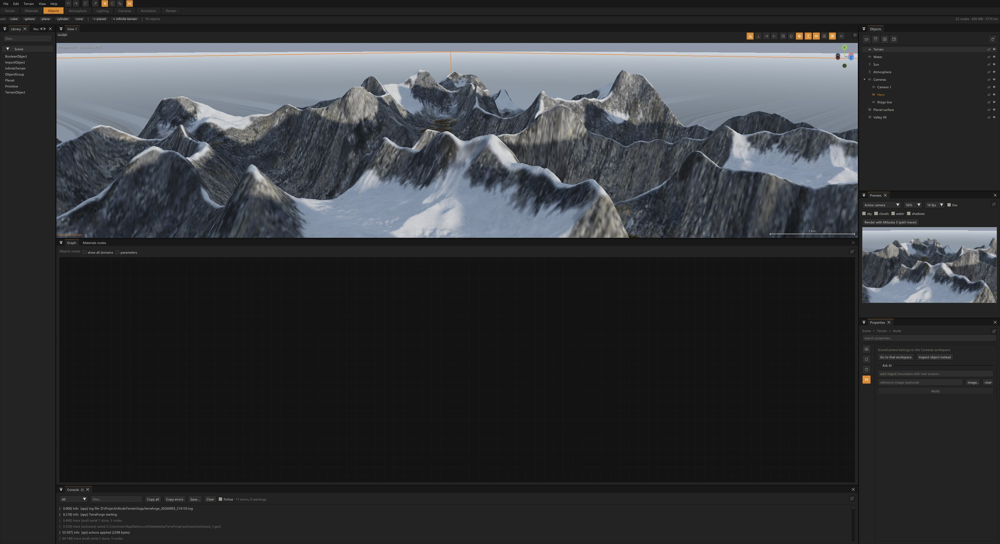 *Objects: the scene tree — terrain, water, sun, atmosphere, cameras and planet surfaces, each lockable and hideable.* | 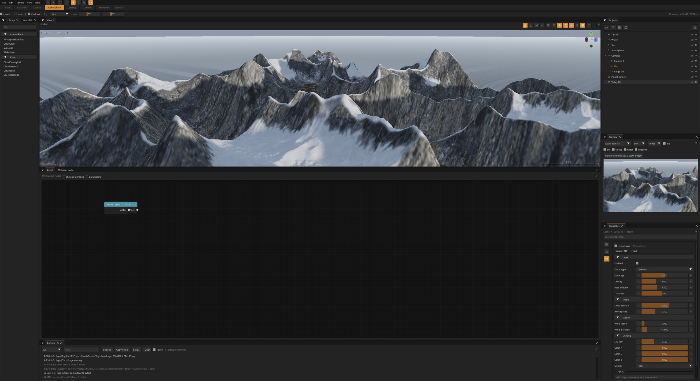 *Atmosphere: sun by clock and calendar or by hand, sky, haze, volumetric cloud and water in one place.* |
| 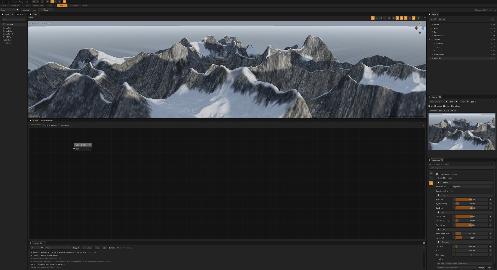 *Cameras: real optics — sensor format, focal length, and an exposure triangle that tells you when the shot is blown.* | 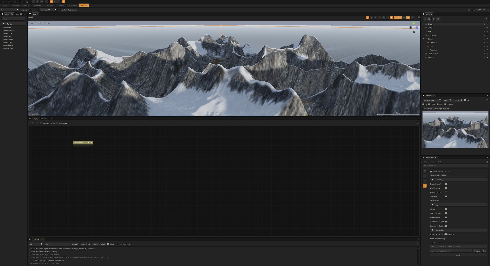 *Render: engines, and the twelve G-buffer passes each written as a linear EXR beside the beauty.* |
|  *Lighting: a LightSource node places and keeps a real scene light, alongside the sun.* | 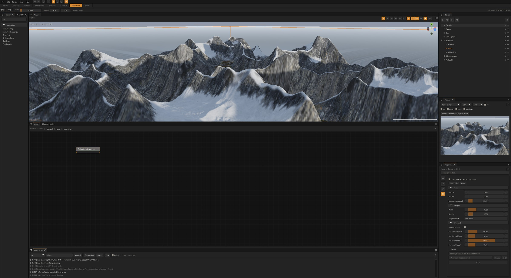 *Animation: transport, keys on any attribute, and an AnimationSequence node that declares the shot.* |
|  *The terrain tile wrapped onto a 250 m planet — same nodes, same erosion.* |  *A new planet shaped by its own surface graph, the home tile in front.* |

## Features

### The node graph
- **Two domains, one graph.** Alongside the raster graph — buffers, neighbour-
  aware, where erosion lives — is a **field domain**: nodes that evaluate a
  single point in 3D and are therefore resolution-independent. `Rasterize` and
  `Sample` bridge the two, so a procedural field can be baked for erosion and
  an eroded heightfield can be read back by a field graph.
- **Field graphs compile to GLSL.** A field network is transpiled to a shader
  and evaluated on the GPU, sharing its noise implementation with the planet
  renderer so the two agree by construction. CPU and GPU results are verified
  to agree to within 1.3e-5 over 20,480 samples.
- **Bypass any node** (`Ctrl+E`) — the graph resolves links straight through
  it, so it works down chains, in both domains, and for every future node.
- **MetaNodes** (`Ctrl+G`): group a subgraph into one node, publish the few
  parameters that matter, and save it to your library as a reusable node with
  its tuned values intact. Saved nodes appear under **My nodes**.
- **Universal blend.** Any node that turns terrain into terrain gets a mask
  input from the graph itself, so its effect can be limited anywhere without
  each node reimplementing masking.
- **Node List** — the same graph read as a tree from the result backwards,
  with per-row bypass, so a scene can be built and understood without
  untangling the network view.
- **Animation-ready:** every parameter can carry a keyframe track (linear,
  smooth or constant), sampled before evaluation. *The timeline UI is not
  built yet.*

### Vue-class fractals
- **`NoiseFractal`** — the manual's Simple / Grainy / Variable-Roughness /
  Fast Perlin fractals in one node, grouped as Vue groups them: base noise
  (Perlin, value, cellular, cell edges, grainy; per-harmonic rotation; double
  noise; filter steepness), scale (wavelength, X/Y stretch, stretch damping),
  fractal (iterations, scale ratio, amplitude ratio, roughness, gain, nine
  combination modes), variation (smooth level, influence, local influence,
  grain variation), distortion (amount, scale, an optional distortion map),
  filter (profile, terrace steps, creep-in, range) and output. Every fractal
  has the second output Vue's have: **rough areas**, the local roughness,
  with a reference feature size — to drive material distribution.
- **`TerrainFractal`** adds the landscape type (plain, ridges, billows, ridge
  mix, billow-ridge mix), blend, ridge smoothness and bump surge.
- **`TerrainFractal2`** — rocks emerging from sedimentary soil: overall
  aspect (turbulence and its damping, large-scale smoothness and contrast,
  buoyancy), ground aspect (bump surge, rock abundance, soil thickness, rock
  dispersion), relief-following strata (strength, spacing, offset).
- **`RockyMountains`** — ridge networks added per iteration, as separate
  mountains or basins between ridges; scale factor, flat level, ground level,
  subdivision quality, per-iteration stretch, distortion, optional rocks
  (correlation iteration, roughness, height) and the eroded variant.
- **Images and fractals both drive the terrain:** a texture wired into any
  heightmap input reads as its luminance (an image file straight into
  `TerrainOutput`), and a heightmap into any texture input reads as a grey
  image. Field-domain nodes show a preview in the graph, and output
  connectors show what they carry (range, size, point count, a field's value).

### The studio
- **Node cards:** rounded nodes with a category-coloured title bar,
  connectors on the left and right edges coloured by data type (the wires
  carry the same colour), and three detail levels per node — expanded,
  compact, title bar only — from the header chevron or `H`. Text stays
  crisp at any zoom.
- **Several node editors:** `View > New node editor` opens another graph
  window pinned to a domain (terrain, materials, atmosphere, render, all),
  each with its own canvas and a side pane showing the selected node's
  parameters.
- **Windows that leave the window:** every panel has a corner button that
  floats it out of the main window — onto a second monitor when there is
  one — and docks it back.
- **As many viewports as you want, wherever you want them.** Up to eight 3D
  views, each a normal window: drag one anywhere, split it, tab it beside
  the node editor, float it onto another monitor, close it from its own tab.
  **Viewports ▸ Arrange** lays the viewport area out in 1–8 cells (2×2 is one
  click) and touches nothing else on screen; **Split right** and **Split
  down** divide the view you last worked in. Adding or closing a viewport
  never rebuilds the layout, so an arrangement you built by hand survives.
- **Layouts, saved by name.** The arrangement is remembered between sessions
  on its own, and **View ▸ Layouts ▸ Save current layout…** keeps as many
  named ones as you like — the dock arrangement, which viewports are open and
  what each shows, which panels are open and which node editors exist. A
  layout never contains the scene, so *Modelling*, *Texturing* and *Lighting*
  load over any project. Scripts and the assistant reach all of it:
  `save_layout`, `load_layout`, `arrange_views`, `add_view`, `close_view`.
- **Gizmos on everything, with a lock:** meshes, lights, cameras, planets,
  the water level and the sun all move (and turn, and scale where it makes
  sense) with the viewport gizmo. The padlock beside each object in the
  Objects tree locks it in place: no gizmo, no dragging, transform fields
  read-only. `set_locked` does the same from the API.
- **Frame pacing:** Edit ▸ Preferences sets the viewport rate, the idle rate
  the whole application drops to when nothing is happening (it wakes on the
  first input), and the Preview panel's own rate and render scale — so six
  views and a live preview never hold the GPU while you think.
- **Preview panel:** the chosen camera's view at the camera's aspect ratio,
  with its own sky/clouds/water/shadow switches and render scale, redrawn
  live as the graph changes even when the working viewports have all of
  that turned off; one button renders it with the camera's final engine
  and shows the passes as they arrive.

### Displacement
- **Redirect** moves where another field is evaluated. Warp, flow, swirl and
  domain distortion are all this one node, and it works on anything — noise,
  a sampled heightfield, another redirect.
- **Displace** turns a value into relief: along the surface normal, straight
  up, along a vector or a fixed direction; depth in real units or relative to
  a reference size; smoothing; a **quality boost** so relief can resolve finer
  than the geometry carrying it; and displace-outwards-only.
- **Compute Normal** recovers the surface direction *after* displacement, so
  "snow above this altitude on slopes below this angle" means the displaced
  terrain rather than the flat plane underneath it.
- **Zones** confine a field to a sphere or box with a smooth fade, and expose
  the region on its own as a mask.
- **Live on the GPU:** wire a field into a `TerrainDisplacement` node and the
  viewport compiles it to a shader and evaluates it per vertex, normals and
  shadows included. A field has no resolution, so the relief keeps resolving
  as the camera closes in. If a graph produces a shader that will not build,
  the viewport keeps the last good one instead of going black.
- **Adaptive subdivision.** The terrain is tessellated to whatever the camera
  needs rather than to a fixed grid — 64×64 patches subdivided per edge by
  that edge's length in pixels, from an effective 512 across (exactly the
  fixed grid it replaces, so it is never coarser) up to 2048 where the camera
  is close. Levels are chosen per edge from its two endpoints, so adjacent
  patches always agree and no crack can open; spacing is fractional, so a
  patch's level changes continuously instead of popping.
- **Both domains, both directions.** A graph that samples a buffer can drive
  the viewport too, so an *eroded* heightfield can shade or displace the
  surface — bake a field for erosion, then take the result back out.

### Environment-sensitive materials
- **Distribution** answers *where a material belongs* — by altitude, steepness
  and which way the ground faces, each with a soft band. The criteria multiply,
  so a material sits where every condition holds, the way you would say it out
  loud: "rock, on the steep bits, below the snow line."
- Because a distribution reads the surface *after* displacement, "snow above
  this altitude on slopes below this angle" means the displaced terrain rather
  than the flat plane underneath it.
- **Colour blending** in the field domain — mix, add, multiply, screen,
  overlay, darken, lighten — with the factor meaning the same thing in every
  mode.
- **Live on the GPU:** wire a colour field into a `TerrainSurface` node and
  the viewport shades the terrain with it per pixel. Slope and facing come
  from the shaded normal, so the distribution follows detail finer than the
  heightmap carrying it.
- **One graph, several channels.** The same node also takes **roughness** and
  **bump**, each its own field. The distribution that decides where the grass
  goes can say that the grass is rougher than the rock and has a finer grain.
  An unconnected channel leaves that part of the shading alone.

### Meshes: import, analyse, repair, reduce, export
- **Bring a model in:** OBJ, STL (binary and ascii), PLY and OFF, read and
  written by hand with no dependency. The file's own coordinates are kept
  and the object is placed and sized by its transform, so a millimetre in
  the file is still a millimetre in the report.
- **Know what is wrong with it.** Eleven checks, each with a count, a
  severity and *where it is on the model*: open holes and their boundary
  loops, non-manifold edges, inconsistent winding, inside-out normals,
  degenerate and duplicate triangles, duplicate and unused vertices, sliver
  triangles, separate shells, unusual scale - with volume, surface area,
  Euler number, genus and size, a **0-100 readiness score** and a verdict.
  Click an issue and the spots are marked in the viewport.
- **Repair, measured.** Junk geometry, welding, winding, the inside-out
  flip and hole filling, repeated until the mesh stops changing - then
  **re-analysed from scratch**, so the before/after table is measured on
  the repaired mesh rather than predicted from the operations that ran.
  Undoable like everything else.
- **Reduce** by quadric edge collapse to a triangle target (Vue's Decimate),
  reporting the largest surface deviation it *measured* against the
  original, in millimetres and as a fraction of the model.
- **Rebuild it as quads.** *Reduce* thins the triangles it was given;
  **Rebuild as quads** replaces the surface with evenly sized,
  curvature-aligned quads — the right tool for a sculpt or a scan, and the
  only one of the two that changes the topology. A 768-triangle sphere comes
  back as 164 quads, still watertight. Powered by
  [QuadriFlow](https://github.com/hjwdzh/QuadriFlow) (BSD-3), built without
  Boost by using its own dependency-free max-flow solver — the patch and what
  it costs are in [docs/LICENSING.md](docs/LICENSING.md).
- **Split** a multi-part model into one object per shell; **export** to STL,
  OBJ, PLY or OFF - and it says on the way out when the mesh is not a closed
  solid, because an open surface slices as a single-wall shell with no
  infill however the slicer is set.
- Objects ▸ *import mesh · analyse · repair · mesh tools*, or the whole set
  from a script: `import_mesh`, `mesh_analyse`, `mesh_repair`,
  `mesh_reduce`, `mesh_split`, `mesh_export`.
- **Rebuild it as a solid.** Overlapping shells are the defect nothing else
  here can even see: two closed pieces running through each other read as
  perfectly valid, and print as neither. **Solidify** rebuilds the surface as
  a solid that is manifold by construction and unions the pieces into one —
  two half-overlapping cubes go from 2 shells to 1, from 24 triangles to 36,
  enclosing the union rather than the sum. Repair runs it by itself when its
  own stages cannot close a mesh. Powered by
  [Manifold](https://github.com/elalish/manifold) v3.5.2 (Apache-2.0),
  which `scripts/get_deps` fetches; without it the stage is disabled and
  **says so** rather than quietly doing something weaker.
- This is [Meshwright](https://github.com/GeekatplayStudio/Meshwright)
  (Geekatplay Studio, MIT) ported from Python to C++ and rebuilt in the
  studio's own UI. Its GPL-licensed engines — MeshLab and MeshFix — are
  deliberately not part of it; see [docs/LICENSING.md](docs/LICENSING.md) for
  what was checked, when, and why.

### The Materials workspace
- **Arranged like a material editor, not a terrain screen.** Switch to
  Materials and the screen becomes: the **Material Studio** on top — the
  material being edited, its live preview and every one of its properties —
  a thin **Material Browser** beneath it, and under those the node graph
  that makes the material beside a scene view that shows it on the ground.
  Every workspace now keeps its own arrangement and remembers what you did
  to it.
- **Six kinds of material**, read from the graph rather than stored:
  *Simple* (channels fed directly), *PBR textures*, *Mixed* (two materials
  through a mask), *Layered* (a stack with presence rules per layer),
  **Distribution** — a layer whose presence also decides where objects
  stand, so the ground and the population share one rule — and
  **Effector**, a material that influences rather than colours: a typed
  field (pressure, wind, light, heat, moisture) that systems arriving later
  read by kind. Choose a type and the studio scaffolds the nodes it needs,
  keeping what the material already had.
- **A live preview per material** — sphere, cube or flat, three
  backgrounds, a turntable — from a texture cache that re-uploads only when
  the material actually changed, so a spinning preview costs nothing and a
  browser page of thumbnails uploads each once.
- **Laid out as Vue's Advanced Material Editor.** Preview with its options,
  Randomize, Zoom and Store (snapshots you can come back to); the material
  hierarchy — the material, its layers top first, the two materials a mix
  mixes — with the three-state visibility switch and Add / Remove / Up /
  Down; and the tabs of whichever line is selected. Every channel has a
  mode: **Constant**, **Mapped picture** (load, rotate, invert, mirror,
  gamma, scale, offset), **Procedural** (any function node) or **Natural
  grain** (two colours through a noise). A layer has its **Presence** tab —
  altitude by terrain, absolute or relative to sea, slope, orientation,
  alpha boost — and a mixed material its **Materials to mix**, **Alpha** and
  **Influence of environment** tabs.
- **Every property, in Vue's tabs.** *Color* (overall tint, brightness,
  saturation, map scale and origin), *Bump* (normal intensity, bump depth,
  slope dependence, displacement), *Highlights* (GGX or Phong, intensity,
  roughness, highlight colour, anisotropy), *Transparency* (amount,
  refraction index, turn reflective with angle, flare, thin surface,
  additive), *Reflection* (reflectivity, minimal reflectivity, angle
  sensitivity, blur, metalness), *Translucency* (subsurface depth, balance,
  scattering colour, backlight) and *Effects* (diffuse/ambient split,
  luminous, contrast, shadows, coloured reflected and transmitted light).
  Each channel has a mode — none, a picture from disk, or procedural — and
  the terrain and the preview sphere shade from the same numbers through the
  same GLSL, so what the sphere shows is what the ground gets.
- **New / Save / Load** as Vue lays them out; a material changed since it
  was opened is marked *modified* and the studio asks before switching away.
- **The browser**: *Project* materials and the *Library*, thumbnails with a
  hover card showing what each is made of; double-click opens, right-click
  assigns or saves. Removing from the library moves to a trash folder.
- **The asset manager** is the browser's third tab. Every watched folder —
  the material library and your layouts by default, any folder of meshes or
  textures you add — is indexed, and found by typing what a thing *is*: name,
  the folders it sits in, the tags and the note you gave it. "mossy rock"
  finds `Moss_Rock_02`; "mos" already does. It is a TF-IDF vector search
  with no model and no service, deterministic and microseconds a record;
  double-click opens (a material into the studio, a mesh as an object, a
  layout applied), right-click tags, notes, trashes — never deletes — and
  restores. The index is one JSON file you can read.
- **Everything the studio and the browser do is an op** — `open_material`,
  `set_material_type`, `save_material`, `asset_search`, `asset_tag`... — so
  the assistant, the Python API and MCP drive them the same way you do.

### AI as a tool
- **Generate a tileable texture, a 360 skydome, an image or a 3D model** from
  a prompt — *AI* menu, or the Objects tool row. A local ComfyUI or Ollama,
  or OpenAI, Anthropic, Gemini, Stability, Meshy, Tripo, Hitem3D with your
  own keys. Results land in your library and the asset index; a texture can
  go straight onto the open material, a sky into the backdrop, a model into
  the scene. Jobs run in the background with progress and cancel.
- **Describe a scene, a terrain or an atmosphere in words** and the text
  model builds it through the same actions the assistant, the Python API and
  MCP use. See [docs/AI_SERVICES.md](docs/AI_SERVICES.md).
- **Settings** (`Ctrl+,`): keyboard shortcuts you can remap, AI services and
  keys (stored protected), the ComfyUI installation and workflow folders,
  external applications, the folders the asset index watches.

### The lens, simulated
- **One switch per camera.** Off, the lens is perfect. On, the picture goes
  through what that lens would actually do to it — in the viewport, in the
  Preview panel and in every captured image, so what you see is what you get.
- **Distortion follows the focal length.** A 14 mm barrels, a 35 mm is nearly
  rectilinear, a 200 mm pincushions — derived from the focal length and the
  sensor format, or dialled by hand. The frame is scaled to stay filled, as a
  sensor crops what the lens delivers, so a long lens never draws black
  corners.
- **Vignetting follows the aperture** — f/2 falls off far more than f/16 —
  scaled by an amount you set.
- **Chromatic aberration** as real lateral fringing: the channels focus at
  slightly different scales, so colour separates toward the corners and
  vanishes in the middle. Off until asked for.
- **Shutter blur**: how much of the camera's own movement the shutter smears
  into the frame, scaled by the shutter speed. (The viewport blurs what the
  camera did; the render engines get the shutter itself.)
- **Lens flare**, optional: ghosts along the sun–centre axis and a halo, and
  only while the sun is actually in frame.
- **Copy settings** puts one camera's lens, exposure and film on every other
  camera, leaving each shot where it stands.

### Points, paths and scattering
- **A third domain: point clouds.** ScatterPoints (random, jittered grid, or
  spaced), relaxation, mask filtering, merging, shuffling, values sampled
  from any heightmap; stamp clouds into rasters or exact distance fields.
- **Paths are ordered clouds.** Thread a scatter into a tour, resample it
  evenly, spline through it (Catmull-Rom), fractalize it into a coastline
  wander, or route it across the terrain with a slope-penalty least-cost
  search — then hand it to PathCarve for the riverbed.
- **EcoSystem-style scattering.** Bind any imported mesh to a Points node and
  instanced copies stand on the terrain — hashed yaw, size and brightness
  jitter per copy, live in the viewport and identical in every offline
  render engine. CSV/PLY export and CSV import round-trip the clouds.

### Terrain analysis
- **Flow accumulation** (D8): how much water passes through each point.
- **Wetness index** — `ln(a/tan b)`, the standard measure of where water
  collects. High in flat hollows fed from above, low on steep ground, so a
  vegetation or moss mask sits where you would expect it.
- **Resample** at half, quarter, double or a custom sampling — detail control
  without changing the buffer size.

### Terrain
- **Node graph engine** with dirty-tracking evaluation, multithreaded solvers,
  per-node previews and timings, and any resolution from 64 to 8192.
- **Erosion that models the physics:** particle-droplet hydraulic erosion, a
  shallow-water pipe-model solver, explicit and implicit (Braun-Willett)
  stream-power fluvial incision with tectonic uplift and rock hardness,
  thermal talus weathering, aeolian dunes and sediment deposition.
- **Every erosion node reports what it did, as masks:** `Hydraulic` gives
  erosion, deposition, standing water, exposed bedrock and the signed change;
  `Thermal` gives exposed faces, talus and the change (and takes an angle of
  repose in degrees); `StreamPower` gives incision, deposit and the change;
  `Wind` gives abrasion, deposit and the change; `SedimentDeposit` gives the
  blanket and what it left exposed. Wire any of them into a material.
- **Terrain ▸ Realistic mountain range:** the preset that reads as a real
  range — eroded ridges, the shallow-water solver, stream power cutting the
  drainage network, thermal talus and gullies, material masks on the end —
  tuned headlessly with `tools/chain_preview` against a dozen alternatives.
- **Erosion that decides what grows where:** `ErosionLayers` runs thermal +
  hydraulic erosion and turns the simulation's side channels (scour, silt,
  talus, drainage, standing water) into a stack of material masks — bedrock,
  scree, soil, grass, sediment, riverbed, snow — plus wetness and flow. The
  layers are priority-ordered and always sum to one, and come packed as two
  splat textures too. One graph serves both editors: the erosion node shows
  in the Materials workspace as soon as its masks are wired into a material.
- **Generators:** multi-type coherent noise (Perlin/ridged/billow/Swiss/value/
  Worley), diamond-square and fault fractals, geometric shapes, geological
  strata, craters, dunes.
- **Surface realism:** multi-scale power-fractal displacement, procedural
  boulders, tilted stratification, shear folding, slope-targeted craggy
  detail, snow with settle-thaw, rivers and coastlines.
- **Modeling:** import heightfield images and stamp them onto the terrain
  with blending and falloff.
- **Sculpting:** brush directly on the terrain in any viewport — raise,
  flatten, smooth, terrace, noise and erase, with radius/flow/falloff, an
  on-surface brush ring and mouse-wheel resizing. Strokes live in a
  `TerrainSculpt` node in the graph as their own layer, so retuning the
  procedural terrain underneath never destroys your hand edits, and each
  stroke is one undo step.
- **Effects:** one-click, deterministic finishing nodes — Grit, Gravel
  (slope-seeking debris), Peaks, Sharpen, Cracks, Glaciation (U-valleys
  below an ice line), Dissolve (stream-carving with a flow-map output), and
  altitude clipping with flat tops, holes and a clip mask.
- **Style presets:** the Terrain menu drops complete editable node chains —
  Mountain, Ridged peaks, Eroded mountain, Canyon, Dunes, Iceberg, Lunar —
  with a fresh seed every click.

### Planets and infinite terrains
- **A new scene is already a landscape.** The home planet's surface is the
  *Realistic terrain* layer: eroded ridged mountains in upland belts, rolling
  hills, terraced plateaus, a network of carved valleys and lowland lakes,
  with the sea at the water level - and the same altitude/slope/wetness
  palette shades the tile, the ground beyond it and every planet, so
  beaches, fields, forest belts, rock, scree and snow land where they belong.
  Three more layer styles (hills, ridged, dunes) stack with it, and a field
  graph can shape the surface further.
- **Terrain is placed onto the planet, not laid over it.** Whatever the
  graph builds - a stamped mountain, a normalised range, a hole - is settled
  to the planet's ground level; the planet's relief shows through wherever
  the tile is flat, is levelled underneath the tile's features (or kept
  beneath them: *Flatten beneath*), and every join is feathered. A hole dug
  below the water level fills with water. Terrain ▸ Placement on planet.
- **The home planet is a sphere:** the terrain tile lies on a planet whose
  radius is a real length from a tenth of a millimetre to a billion
  kilometres (Objects ▸ Planet surface, or the Atmosphere tab). Large radii
  give the curved horizon; below the tile's own circumference the tile wraps
  the whole globe, equirectangular, its heights shrinking with it - a 1 m
  planet made from the heightmap, with the same nodes, materials and
  erosion as any terrain. Single-precision positions resolve a globe down
  to about a millionth of the tile width (1 cm at the default 5 km tile);
  for anything smaller, shrink the tile (Terrain ▸ Across) with it.
- **Every world its own graph:** each planet (and the home surround) names
  the `SurfaceDisplacement` node whose field graph displaces it, as a
  Terragen planet has its own terrain network. "New graph for this world" in
  the planet's properties, or `"surface_node":"new"` in `add_planet`.
- **Unlimited planets.** Each is a pure parameter block — radius, relief,
  seed, sea level, snow line, rock and water colors, atmosphere — generated
  on the GPU every frame. No textures, no meshes, no caches, so a hundred
  planets cost the same memory as one. Add them from the Objects panel or by
  asking the AI.
- **Infinite procedural terrains.** Stack any number of endless terrain
  layers (rolling hills / ridged mountains / billow dunes, each with its own
  scale, amplitude, coverage and seed). Parented to a planet they shape its
  surface; at the root they extend the home terrain tile past its edges to
  the horizon, blending seamlessly out of the tile's own heightmap.
- **Your work survives a crash.** The application autosaves every couple of
  minutes whenever the undo history has moved - three files in rotation, the
  user's own project path never touched - and a session that ends without
  closing properly is offered back on the next start, newest autosave first.
- **Lakes, and flow that reaches the sea.** `FillBasins` floods every closed
  basin to the height of its outlet (Priority-Flood). Read one way it is the
  water standing in the hollow - depth and mask outputs, ready to drive a
  material or a blend. Read the other way it is the surface flow routing needs:
  without it D8 routing dead-ends at every pit, and on plain fractal terrain
  81 such cells were swallowing the drainage of 41% of the map.
- **Two noise bases, not one.** fBm for ridges and rolling ground, and
  cellular (Worley) noise for everything fBm cannot make: cracked mud, basalt
  columns, scree, crater fields and tectonic plates. `FieldVoronoi` gives the
  distance to the nearest cell point, to the second, to the seam between them,
  or one flat height per cell - through round, diamond or square cells. Being
  a field node it compiles to GLSL, so it shapes planets and infinite terrain
  at any scale as well as the finite tile.
- **Shaped by a node graph.** A planet's surface and the endless ground plane
  have no heightmap - they are functions, evaluated on the GPU at whatever
  detail the camera has earned. So they are authored as functions: wire a
  field graph into a `SurfaceDisplacement` node and it is transpiled to GLSL
  and added to every procedural surface in the scene, at every scale, for no
  memory at all. The same field nodes run on the CPU for picking and baking,
  and a test holds the two definitions together.
- **Continuous zoom.** Pull back to see a whole planetary neighbourhood —
  the sky thins to a starfield as you leave the atmosphere — then fly to any
  world (double-click it in the Objects tree) and keep zooming until individual
  ridges resolve. Detail is a *continuous* function of on-screen size, so
  nothing pops as you travel.
- **Progressive quality.** Everything scales with how much a thing is
  actually worth: sub-pixel planets are skipped entirely, sphere meshes swap
  through three LODs with hysteresis so they never flicker at a threshold,
  and shadow maps, volumetric clouds and 4K material maps switch off once
  the camera leaves the ground. Surface shading always evaluates two octaves
  finer than the geometry, so detail below mesh resolution still shows.

### Materials
- **PBR terrain shading:** roughness, metallic, specular, sky reflections,
  translucency, transparency and true displacement mapping.
- **Photoscanned materials:** browse and download CC0 PBR sets (albedo,
  normal, roughness, AO) from ambientCG at up to 8K, cached locally.
- **Multilayer compositing:** splat maps from terrain masks, layer blending,
  color grading, and albedo-to-PBR derivation.
- **Material stack:** `MaterialStack` blends up to six mask + albedo layers
  with height-aware blending (silt fills the cracks of the rock before it
  covers the ridges) into albedo and per-layer roughness for `MaterialOutput`.
  `examples/macros/erosion_materials.json` builds the whole
  erosion → layers → material chain and assigns it to the terrain.

### Scene and lighting
- **Built-in primitives** — cube, sphere, plane, cylinder, cone — plus OBJ
  import; every mesh transforms, takes materials, and scatters.
- **Point lights** (up to eight) with color, intensity and reach, agreed on
  by the viewport and every offline engine.
- **Night**: let the sun set and stars come out over a sky, haze and
  surround that darken together — a campfire in the dark is one AI prompt.
- **Real-world terrain**: SRTM `.hgt` tiles and uncompressed GeoTIFF DEMs
  import directly, alongside 8/16-bit PNG heightmaps.
- **Spot lights** too: cone angle, heading and pitch, in the viewport and
  every engine.

### Environment and rendering
- **Volumetric clouds** raymarched with Perlin-Worley noise, cloud types
  (stratus / cumulus / cumulonimbus), coverage, wind and self-shadowing.
- **Sky and light:** configurable atmosphere, height fog with absorption and
  sun scattering, and a sun that can be positioned manually or from a real
  latitude, longitude, date and time.
- **Water:** depth-graded color, waves, and shoreline and crest foam.
- **Viewport:** 1-6 dockable view windows (perspective / top / front / right),
  shading modes, shadow mapping, scale bar, metric or imperial units.
- **Offline rendering:** path-traced output through Mitsuba 3, Blender Cycles
  or LuxCoreRender. The render reuses the viewport's own sky and clouds as an
  HDR environment, plus the same material, sun, water, fog and tone mapping,
  so the result matches the preview — scattered meshes and point lights
  included.
- **Render passes**: depth and world-normal EXRs beside the beauty image.
- **360° panoramas**: one equirectangular frame from any camera position,
  for skyboxes and VR stills.

### Animation
- **Timeline** (View menu): play/pause/stop, a loop range, a scrub bar, and
  per-attribute keyframing on the selected node — key markers on miniature
  track bars, constant/linear/smooth interpolation per track. Tracks save
  with the project.
- **PNG sequence capture**: the loop range becomes numbered frames through
  the viewport engine, one animation frame per completed evaluation.
- **Fly-throughs**: hand the sequence any path node and the camera rides it
  at terrain height — a spline through scattered waypoints is a camera dolly.
- Scattered meshes sway in the wind, each copy on its own phase.

### AI assistance
Describe a landscape in plain language — or drop in a photograph — and a local
[Ollama](https://ollama.com) model builds the node graph, parameters,
materials and lighting for you. Everything runs on your machine.

---

## Examples

- `examples/eroded_island.gpxt` — an island landform through hydraulic
  erosion, with a midslope mask feeding a point scatter.
- `examples/routed_river.gpxt` — PathFind routes a least-cost line across
  the noise and PathCarve cuts the riverbed along it.
- `examples/basalt_steps.gpxt` — columnar basalt softened by thermal
  weathering.
- `examples/showcase_valley.gpxt` — a forested island: eroded mountain,
  midrange scatter mask, 900 instanced pines with wind sway, hero camera.

Open them with File > Open (or the `open_project` scripting op) and press
around.

## Install

### Ready-made installers

| Platform | Download | Notes |
|---|---|---|
| **Windows 10/11** | `TerraForge-<version>-Setup.exe` | Installs for your account only, so there is no administrator prompt. A portable `.zip` is published beside it. |
| **macOS 11+** | `TerraForge-<version>.dmg` | Drag to Applications. First launch: right-click → Open (the builds are not notarised). |

### One click from source

```
git clone https://github.com/GeekatplayStudio/TerraForge.art.git
cd TerraForge.art
```

**Windows** — double-click **`install.bat`**
**macOS** — double-click **`install.command`**
**Linux** — run **`./scripts/install.sh`**

Each one checks for the tools it needs and offers to install the missing ones
(winget on Windows, Homebrew on macOS, apt/dnf/pacman on Linux), fetches the
third-party sources, builds, and puts TerraForge where your system expects to
find applications. Add `-Dev` / `--dev` to build without installing.

### Or build it by hand

```powershell
powershell -ExecutionPolicy Bypass -File scripts\get_deps.ps1   # Windows, once
.\build.ps1
.\start.ps1
```

```bash
./scripts/get_deps.sh                                           # macOS / Linux, once
./build.sh
./start.sh
```

`get_deps` fetches Dear ImGui, GLFW, imgui-node-editor, GLM, GLAD, miniz,
nlohmann/json and stb into `external/`. They are not committed to this
repository, and both scripts fetch the same versions.

**[The full install guide](docs/INSTALL.md)** covers prerequisites, flags,
uninstalling, where your files are kept, building the installers yourself, and
what to do when something does not work.

### Requirements

| | Minimum |
|---|---|
| Windows | 10 (1809) or 11, 64-bit |
| macOS | 11 Big Sur or newer, Intel or Apple silicon |
| Linux | any current distribution, X11 or Wayland |
| Graphics | OpenGL 4.3, or 4.1 on macOS — any GPU since roughly 2012 |
| Build tools | CMake 3.20+, Ninja, a C++20 compiler (MinGW-w64 GCC, MSVC, Clang or GCC) |
| Python 3.9+ | optional: the offline path tracers and the AI assistant |

macOS caps OpenGL at 4.1, so TerraForge asks for a 4.1 core profile there and
compiles its shaders at `#version 410 core`. It uses nothing above 4.1 — no
compute shaders, no shader storage buffers, no explicit binding layouts — so
adaptive tessellation, volumetric clouds, shadows and the render passes all
work on a Mac.

### Optional extras

```
pip install mitsuba                # path-traced offline rendering
pip install -r requirements.txt    # the whole Python layer
ollama pull llama3.1               # AI terrain from a description
ollama pull llava                  # AI terrain from a photograph
```

## Run the tests

```powershell
.\test.ps1      # Windows
./test.sh       # macOS / Linux
```

Seven suites, all of which must pass before a commit:

| Suite | Covers |
|---|---|
| `nodeterrain_tests` | The original solver library and CLI |
| `engine_tests` | Registry, evaluation and caching, cycle rejection, determinism, erosion, materials, serialization, field domain, GLSL transpiler, bypass, MetaNodes, blend, animation |
| `undo_tests` | Restore correctness, redo branching, history jumps, node library round-trip |
| `node_tests` | **Universal node contract** — one data-driven battery over all 118 node types: metadata, ports, determinism, bypass, serialization, extremes, and that every field node has a GLSL emitter. Adding a node automatically tests it. |
| `regression_tests` | **Regression lock** — a node may never be removed or change category, an attribute may never be removed or be retyped, 14 committed projects must still evaluate to the same hash, and every entry in the feature manifest must still name a test that exists. |
| `pytest` | Render backends and AI helpers |

The contract and regression suites are the reason features do not quietly
disappear: 6,056 contract assertions and 1,726 regression checks over 118
node types, 540 attributes and 61 manifest features. If a change to a golden
is intentional, `regression_tests --update` re-records it — review that diff
rather than trusting it.

---

## Logs and crash reports

Every console message is also appended, flushed line by line, to
`logs/terraforge_<stamp>.log` under the project root (or `$TERRAFORGE_LOG_DIR`),
so a crash cannot take the log with it. `std::terminate`, `abort()`, a UCRT
invalid-parameter and unhandled SEH exceptions each write
`logs/crash_<stamp>.txt` with the reason (an uncaught exception's `what()`
included) and a stack as `module+RVA`. The build carries `-g`, so
`python scripts/resolve_crash.py` turns those frames into `file:line`;
`python scripts/dump_stack.py <file.dmp>` reads a Windows minidump the same
way. `{"op":"debug_crash"}` on the actions API exercises the whole pipeline.
The `logs/` folder is local and never committed.

## Project layout

| Path | Contents |
|---|---|
| `engine/` | Terrain engine: heightmaps, node graph, attributes, node packs |
| `studio/` | Desktop application: viewports, renderer, panels, AI, scene |
| `orchestrator/` | Python layer: render backends, AI helpers |
| `mcp_server/` | Tool server exposing the engine for automation |
| `src/`, `include/` | Original C++ solver library and CLI |
| `tests/` | C++ and Python test suites |
| `tests/manifest/` | The regression lock's records: node, attribute, golden and feature censuses |
| `tests/projects/` | Golden `.gpxt` projects, re-evaluated to a hash on every run |
| `scripts/` | Dependency fetchers and the one-click installers |
| `packaging/` | Windows setup program (Inno Setup) and macOS .app / .dmg builders |

## Usage notes

- **Workspaces** across the top switch the editor between Terrain, Materials,
  Objects, Atmosphere, Lighting, Cameras, Animation and Render.
- **Properties** is a tabbed editor (Render, Scene, World, Object, Material,
  Node) that follows what you select and has a search box.
- **Right-click a viewport** for view options; the same menu sets how many
  view windows you want. Layouts persist between sessions.
- **In the node graph:** `Ctrl+E` bypasses the selected nodes, `Ctrl+G` groups
  them into a MetaNode and `Ctrl+Shift+G` expands one back out. Bypassed nodes
  are dimmed and tagged.
- **Node List** (tabbed with the Library) shows the same graph as a tree from
  the terrain result backwards, with each node's inputs indented beneath it.
  Nodes that do not reach the result are listed separately rather than being
  silently ignored.
- **Undo/redo** (`Ctrl+Z` / `Ctrl+Y`, also `Ctrl+Shift+Z`) covers the node
  graph, scene objects and world settings as one history. Every step is
  named, and **Edit > History** lists them so you can jump straight back to
  any earlier point. Changes made by the AI assistant, the Python API and
  MCP are ordinary history steps, so they can be taken back the same way.
- Projects are saved as `.gpxt` JSON files.

### Undo/redo from automation

```python
from mcp_server.studio_api import Studio

s = Studio()
s.set_sun(azimuth_deg=250, altitude_deg=12)  # one history step, "AI: set_sun"
s.undo()                              # take it back
s.redo()                              # and put it back
```

The same is available over MCP as `studio_undo` / `studio_redo`, and to the
in-app assistant as `{"op": "undo", "steps": 1}`. All four surfaces run the
same action schema, so a change is undoable no matter which one made it.

## License

Copyright © Geekatplay Studio.

TerraForge is **free for noncommercial use** under the
[PolyForm Noncommercial License 1.0.0](LICENSE) — use it, modify it, share
it, fork it. Students, hobbyists, teachers, schools, nonprofits, public
research and government bodies are free by name in the licence.

**Commercial use needs a paid licence.** Client work, production, selling
what you make, or use inside a for-profit company — see
[COMMERCIAL.md](COMMERCIAL.md) for where the line sits and how to get one.

**Whatever you make with it is yours.** The licence covers the software, not
your terrains, renders, exports or scenes.

The source is public, readable and forkable, so TerraForge is
*source-available* rather than open source in the formal sense — the one
restriction is commercial use.

Which licences we accept and what was verified when is recorded in
[docs/LICENSING.md](docs/LICENSING.md).

Third-party dependencies keep their own permissive licences (Dear ImGui,
GLFW, GLM, imgui-node-editor, glad, miniz, nlohmann/json, stb) — see
[THIRD-PARTY-NOTICES.md](THIRD-PARTY-NOTICES.md). Downloaded material
libraries are CC0.
